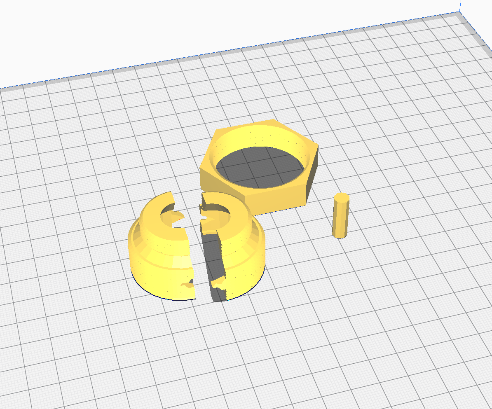
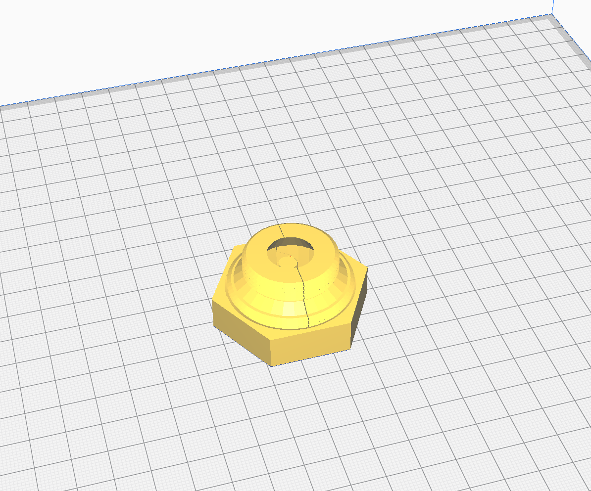

# Vaillant Circo to M30x1.5 (Heimeier) adapter for Elecronic TRV

This is an adapter to fit common electronic thermostats to uncommon old "Vaillant Circo" radiators.

This is remixed from [mikra's](https://www.thingiverse.com/mikra) [snap mount adaptor](https://www.thingiverse.com/thing:2612751) on thingiverse.

Thanks to [aubenc](https://www.thingiverse.com/aubenc) for the [screw/thread library](http://www.thingiverse.com/thing:8796).

I found the original adpator failed to print on my Sovol SV01 and often broke during fitting. This design uses a clamshell style mount that prints in 2 halves secured together with the nut that screws over the larger thread. Variables in valve_vars.scad can be used to tweak the output to fit your particular mounting and pin.

## Slicing/Print Settings

For proper fitting to the thread I recommend printing at 0.15mm layer height and using random or sharpest corner Z seam alignment.

For the 2 vaillant_clip peices I found I needed to print at 40-60% infill with a 3 line wall thickness and 25 initial bottom layers. This prevented the force of the TRV actuator from splitting the print where it grabs the valve at the base of the prints.

All other parts were printed at 20% infill just fine.

